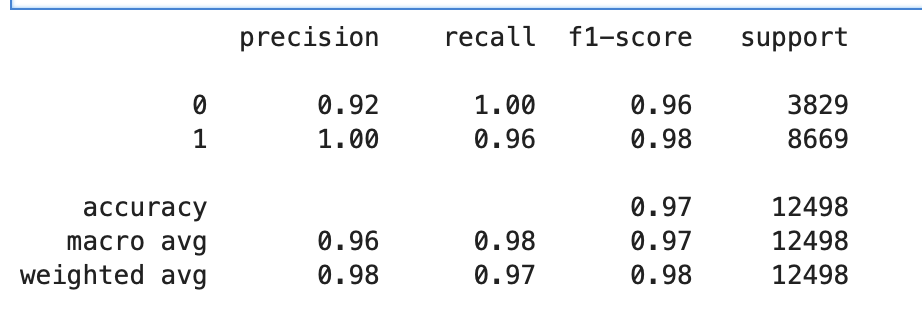
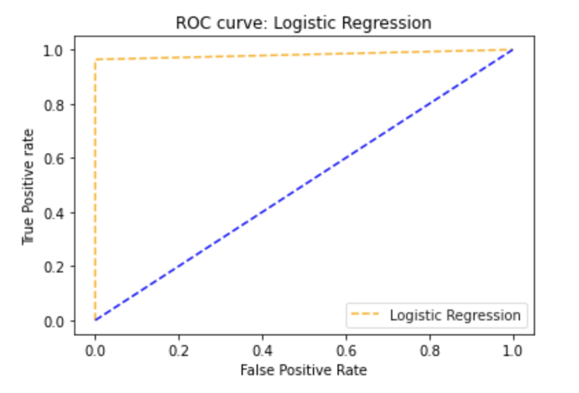
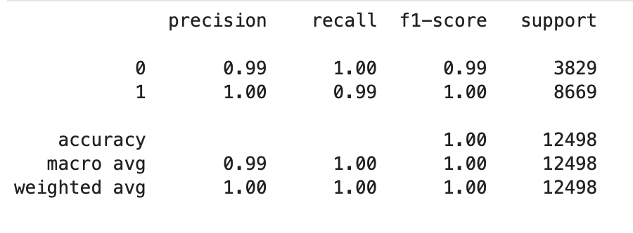
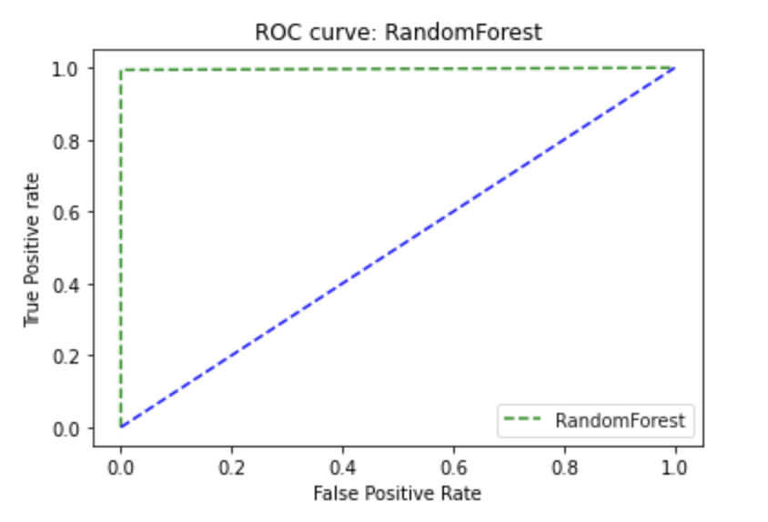
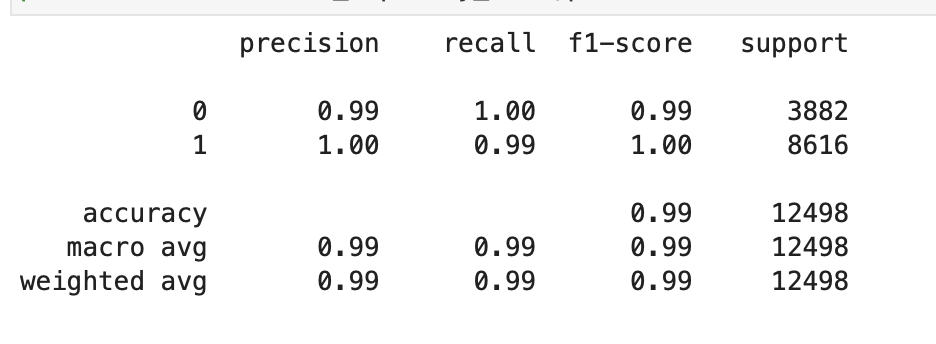
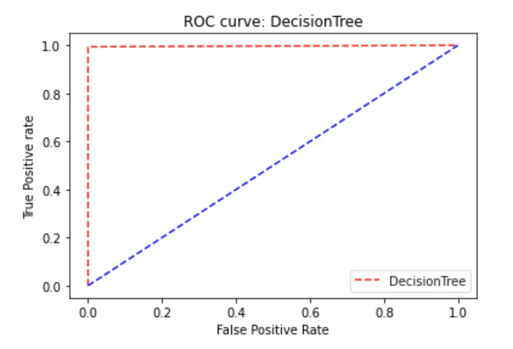
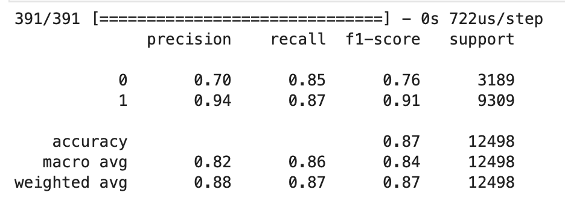
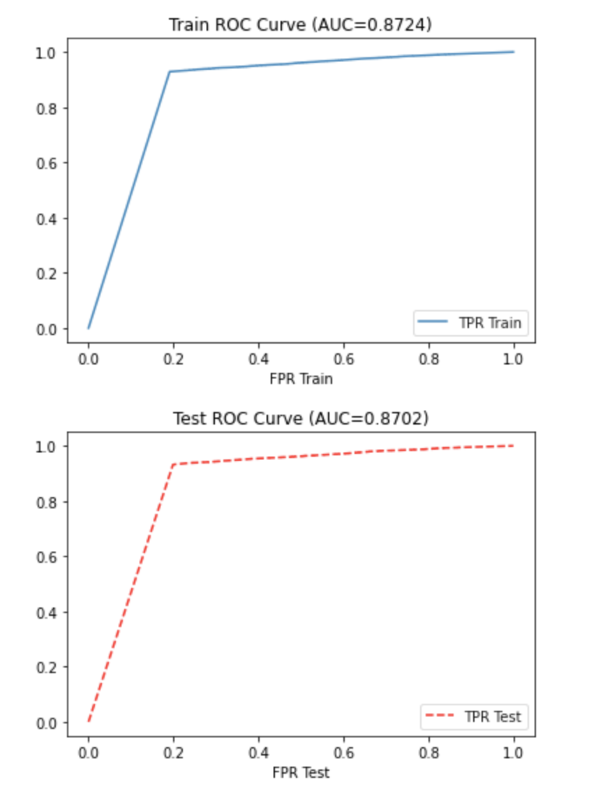

# Loan Approved

## Project Overview

Loan Approved is credit risk assessment tool. It allows user to enter his/her financial information via Streamlit UI and predicts
if the loan  will default.

## Data Generation

We used Faker library to generate 50,000 records categorised as Low, Medium & High Risk

## Machine Learning

We tried with 4 different machine learning models :
*   Logistic Regression
    
    

*   Random Forest
    
    
*   Decision Tree
    
    
*   Deep Learning
    
    

## Usage and Installation Instructions

This application requires below libraries to be installed. It is recommended to use the manager, Conda, however other package and environment management systems can be used. The following dependancies are required:

- pandas
- streamlit
- sklearn
- imblearn
- pickle
- faker

To run the application
- navigate to Fintech-Project-2/Streamlit
- streamlit run LoanAssessment.py --server.port 8501

